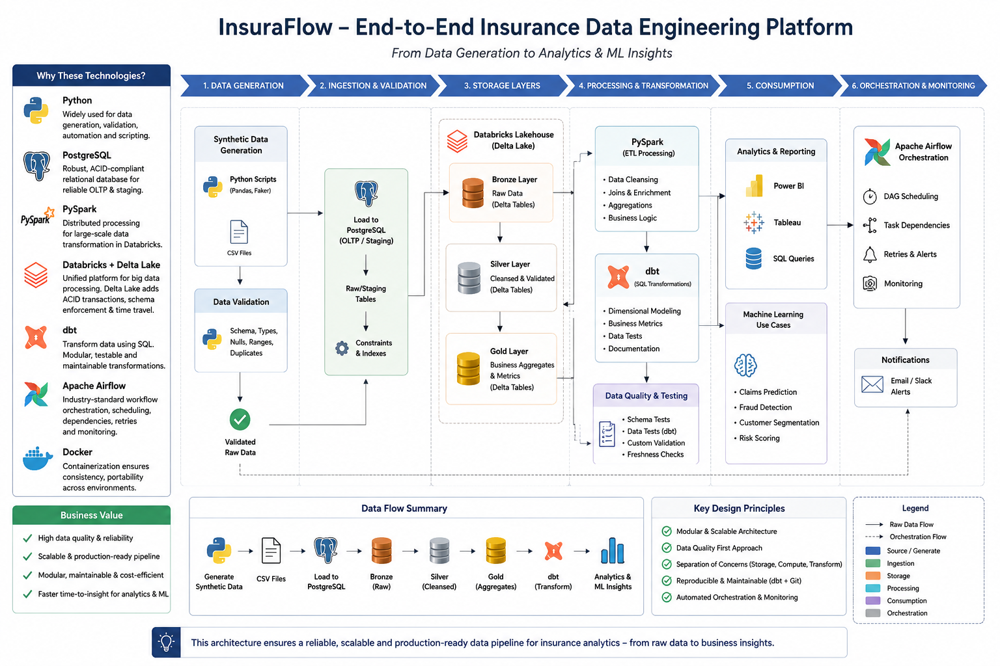

# InsuraFlow

Enterprise insurance analytics engineering platform built with Python, PySpark, PostgreSQL, dbt Core, Apache Airflow, Azure Blob Storage, Docker, and Parquet.

## Step 1: Repository setup

This baseline establishes the repository layout, local PostgreSQL service, Airflow runtime image, environment-variable template, and Python dependency manifest. No data pipeline, schema, DAG, dbt model, or sample data is included yet.

### Prerequisites

- Git
- Docker Desktop with Docker Compose v2
- Python 3.11

### Local setup

1. Create a local environment file: `Copy-Item .env.example .env`.
2. Replace the placeholder passwords and generate a Fernet key:
   `docker run --rm apache/airflow:2.10.4-python3.11 python -c "from cryptography.fernet import Fernet; print(Fernet.generate_key().decode())"`
3. Create and activate a Python virtual environment:
   `py -3.11 -m venv .venv`
   `.\.venv\Scripts\Activate.ps1`
4. Install dependencies: `python -m pip install --upgrade pip` then `pip install -r requirements.txt`.
5. Start PostgreSQL: `docker compose up -d postgres`.
6. Initialize Airflow once: `docker compose --profile airflow run --rm airflow-init`.
7. Start Airflow: `docker compose --profile airflow up -d airflow-webserver airflow-scheduler`.

Airflow is available at `http://localhost:8080`. PostgreSQL connects on `localhost:${POSTGRES_PORT}` using values from `.env`.

## Architecture

